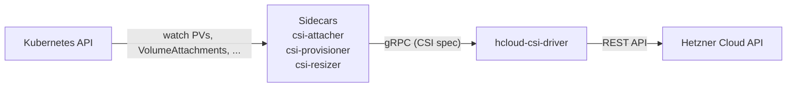
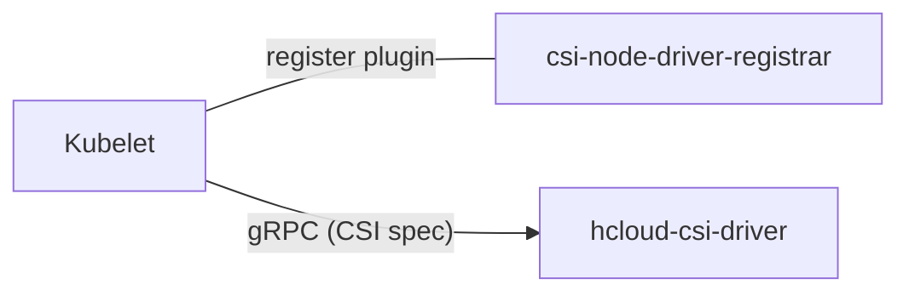

# CSI-Driver Architecture

The hcloud-csi-driver is made up of two main components: the controller, deployed as a Kubernetes Deployment, and the node driver, deployed as a Kubernetes DaemonSet.

## Controller

The controller consists of the following containers:

- **hcloud-csi-driver** (main container)
- csi-attacher (sidecar)
- csi-provisioner (sidecar)
- csi-resizer (sidecar)
- liveness-probe (sidecar)

The `hcloud-csi-driver` container is developed by our team. Its primary purpose is to
communicate with the Hetzner Cloud API to perform volume operations such as creating,
attaching, and resizing volumes. It exposes a gRPC service via a Unix socket,
implementing the interfaces defined in the [Container Storage Interface (CSI) Specification](https://github.com/container-storage-interface/spec).
The sidecars watch for events on PersistentVolumes, VolumeAttachments, etc. and perform
the necessary gRPC requests to the controller.

## Node Driver

The node driver consists of the following containers:

- **hcloud-csi-driver** (main container)
- csi-node-driver-registrar (sidecar)
- liveness-probe (sidecar)

The `csi-node-driver-registrar` registers the CSI driver with the kubelet.
Once registered, the kubelet communicates directly with the `hcloud-csi-driver` via
a Unix socket to perform node-level operations like mounting and unmounting volumes.
The node driver itself does not communicate with the Kubernetes API or the
Hetzner API.

